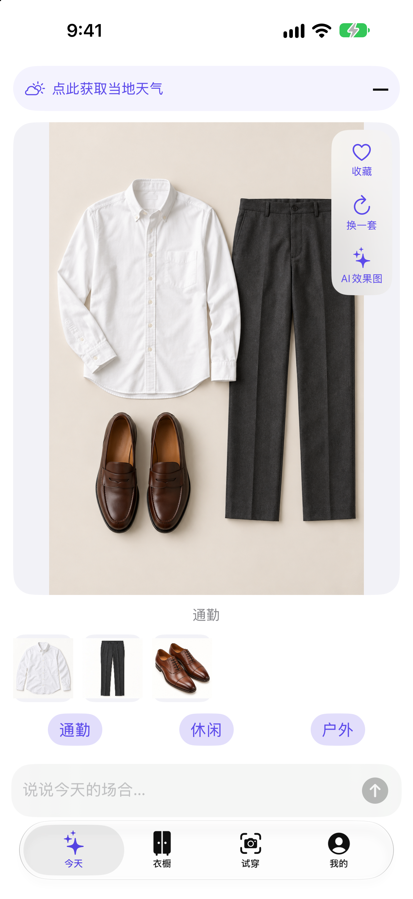
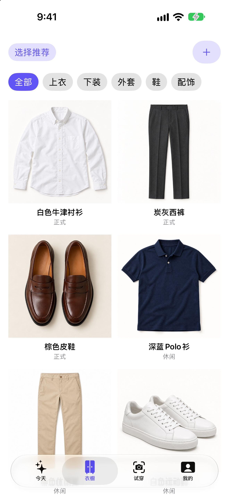
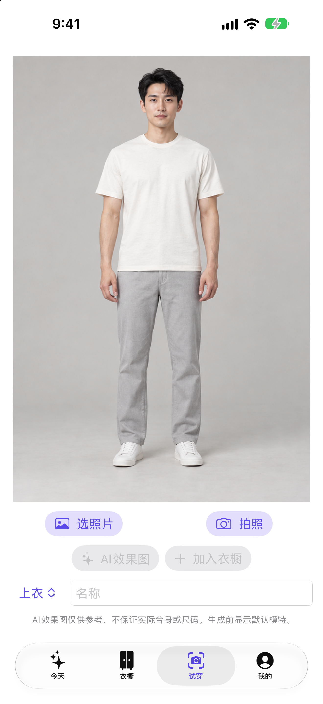
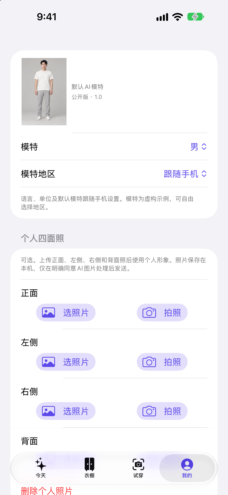
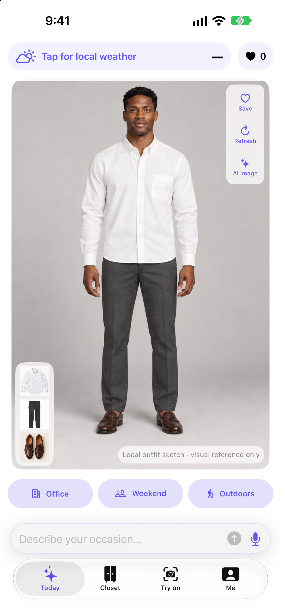
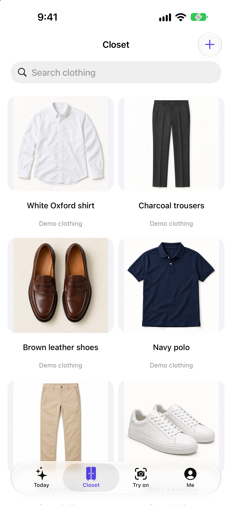
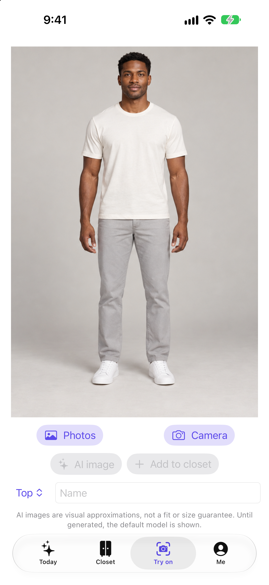
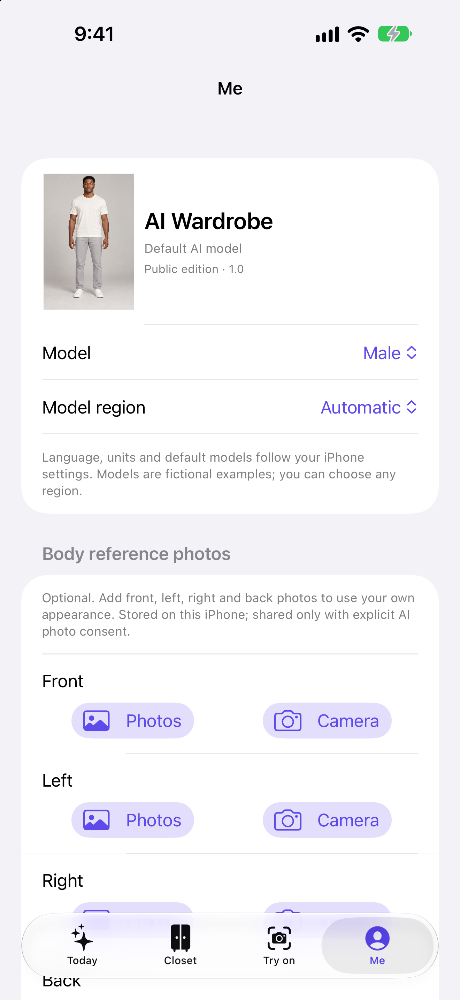

# AI My Wardrobe · AI我的衣橱穿搭

把已有衣服，穿出新灵感。Rediscover the possibilities in your own wardrobe.

A multilingual iPhone wardrobe and outfit companion. Organize your clothes, explore new combinations, and optionally connect your own AI provider.

**iPhone · iOS 18+ · Portrait · 7 languages · Bring your own API key**

[使用指南与隐私政策 / Guides & privacy](https://wliao78.github.io/AI-Wardrobe-Support/) · [English overview](#english-overview) · [发行记录 / Release record](AppStore/RELEASE.md)

> 发行状态（2026-10-03）：1.0（build 2）已提交 Apple 审核，当前记录为 Waiting for Review，审核通过后自动发行。提交审核不等于已经上架。

## 实际界面 / Screenshots

公开版实际模拟器截图，采用虚构示例人物和服饰，不含私人版照片。点击可查看原尺寸。

<table>
<tr><th>今天 · 穿搭灵感</th><th>衣橱 · 单品管理</th><th>试穿 · 正面预览</th><th>我的 · 个性设置</th></tr>
<tr>
<td></td>
<td></td>
<td></td>
<td></td>
</tr>
</table>

English screenshots

全部 [28 张多语言截图](AppStore/Screenshots)及[商店介绍材料](AppStore/Metadata)也随源码提供。

## 把自己的衣橱用起来

- **整理单品**：拍照或导入衣物照片，处理单品图、编辑属性，按上衣、下装、外套、鞋和配饰浏览。
- **探索组合**：三套 demo 可直接体验；结合场景和可用天气信息提供搭配灵感，可以换一套、收藏和查看单品详情。
- **先看示意**：首页显示离线模特穿搭示意。只有点击 AI 图、配置支持的图像服务并同意传图后，才生成在线 AI 效果图。
- **文字与语音**：表达场景或换装需求。语音需要权限与可用音频设备，识别文字先成为可编辑草稿；离线建议不等同于在线 AI 理解。
- **随手机设置变化**：七种语言、地区单位、可手动切换的虚构男女人物。默认形象不会推断用户身份或国籍。
- **可选个人资料**：身高体重和个人四面照均为选填；身高体重只保存在本机，不发送给 AI。

## AI 服务 / Providers

用户自行提供 API Key，模型能力、地区可用性与费用由服务商决定。

| 服务 / Provider | 文字搭配 / Text | AI 效果图 / Images |
| --- | --- | --- |
| OpenAI | 支持 / Yes | 支持 / Yes |
| Google Gemini | 支持 / Yes | 支持 / Yes |
| Anthropic Claude | 支持 / Yes | 不支持 / No |
| DeepSeek | 支持 / Yes | 不支持 / No |
| 通义千问 / Qwen | 支持 / Yes | 不支持 / No |
| 自定义 HTTPS 兼容接口 / Custom compatible endpoint | 支持 / Yes | 不支持 / No |

可以接入中国的 AI，例如 DeepSeek 和 Qwen；文字支持不代表能够生成图片。请使用账号可用的模型 ID，接口或模型变化可能影响兼容性。

## 使用方法与注意事项

1. 无须 Key 即可浏览 demo。在衣橱中拍照或导入自己的单品。
2. 在“我的”设置偏好，可选填身高体重、选择模特或上传个人四面照。
3. 在“今天”选择场景、输入需求、查看或收藏组合；在“试穿”导入照片查看正面示意。
4. 如需在线 AI，在“我的”选择服务商并填写自己的 Key，阅读数据发送提示后再使用。

基础本地功能免费，外部 AI 可能收费，包括产生实际请求的连接测试。建议使用专用、限额的 Key，不要在对话或 GitHub 中分享密钥。

衣橱和资料保存在设备本地，Key 使用设备专属 Keychain。经同意的对话、衣物信息或图片直接发送到所选第三方服务。相机、照片、麦克风、语音和定位按功能需要申请权限；天气功能使用 Apple 服务，示例天气会明确标注。

请仅上传拥有使用权的照片，另存重要原图。本地衣橱不作为自动云备份保存；删除本地数据不会撤回第三方已经收到的数据。离线合成和 AI 图片仅供搭配参考，不保证合身、颜色或细节准确。首发定位为成人用户（18+）。详见[多语言使用指南和隐私政策](https://wliao78.github.io/AI-Wardrobe-Support/)。

## English overview

**Your clothes. More possibilities. Your choice of AI.**

Catalog the clothes you own, discover combinations for different occasions, save favorites, and explore front-view outfit previews. Three fictional demo outfits let you start without an API key. Photograph or import garments to build your own categorized closet.

The Today screen uses an offline model-based outfit sketch. Online image generation happens only after you tap **AI image**, configure a supported image provider, and consent to sharing the required images. Neither sketches nor generated pictures guarantee fit or an exact reproduction of your clothes.

The interface, permission prompts and app name support seven languages. Measurement units follow the device region. Fictional male/female reference defaults can be overridden; optional personal photos and body measurements are stored locally. Defaults do not infer your nationality or identity.

Local features are free. Optional AI uses your own provider account and API key; provider charges and regional availability apply. See the provider table above. Sharing requires consent, and there is no developer-operated content backend, advertising or analytics SDK. Keep backups of important original photos; deleting local data does not retract information already sent to a provider.

**Release status recorded on October 3, 2026:** version 1.0, build 2 is waiting for Apple review, with automatic release configured after approval. App Store availability is not yet confirmed.

## Identity

- Bundle ID: `com.tinyworm.AIWardrobe.Public`
- iPhone, iOS 18 or later, portrait only.
- English, Simplified Chinese, Traditional Chinese, Japanese, French, German and Spanish.
- Localized home-screen names; Simplified Chinese store name: AI我的衣橱穿搭.
- No personal-edition history, photos, garment catalog, credentials or saved conversations.

## Features

Local photo-based wardrobe, complete-silhouette catalog processing, three demo combinations, occasion-based combinations, favorites, optional Apple Weather, optional personal reference photos, and seven regional fictional male/female reference pairs. Defaults follow app language and region and can be changed manually; they do not infer the user's identity or nationality.

OpenAI-compatible adapters cover OpenAI, Gemini, DeepSeek, Qwen and custom HTTPS endpoints. Anthropic uses native Messages. Image generation is supported for OpenAI and Gemini only. Model IDs and account capabilities can change. Users must explicitly consent before clothing/conversation or photo transmission. API keys use device-only Keychain storage; redirects are refused. No developer content backend, ads or analytics.

## Build and verify

Open `AIWardrobe.xcodeproj`, select the AIWardrobe scheme and an iPhone destination. Configure your own signing team when forking. Enable WeatherKit for the exact public bundle ID and its App ID service in Apple Developer; provisioning alone does not verify production WeatherKit access.

Run `node Tests/verify-release.mjs` with Node 22 or later. Compile and run `Tests/AIClientTests.swift` together with `AIWardrobe/Services/AIClient.swift` using Swift 6. Provider tests use controlled responses, not live paid requests. `Tests/capture-screenshots.sh <simulator-id>` captures the four actual screens in seven languages after the simulator build is installed. Use a dedicated simulator, not one shared with another task.

The shared Xcode scheme includes hosted lifecycle/persistence tests and UI tests. Run `xcodebuild test` against a dedicated simulator; `-collect-test-diagnostics never` avoids lengthy sysdiagnose collection on a failed test. Real microphone tests are separate from mocked lifecycle tests. Do not claim speech recognition is verified merely because the UI and lifecycle tests pass. Current speech verification limitations are recorded in `AppStore/RELEASE.md`.

## Release materials

`AppStore/Metadata` contains localized descriptions, subtitles, keywords, promotional text and support/privacy URLs. `AppStore/Screenshots` contains unaltered localized simulator screenshots. Descriptions disclose paid provider usage, permissions, local-only storage and the limitations of visual try-on. Review notes and outstanding release gates are in `AppStore/RELEASE.md`.

Public support and seven-language guides: [AI My Wardrobe Support](https://wliao78.github.io/AI-Wardrobe-Support/).

Live paid AI calls and renewed physical candidate-75 acceptance remain unverified. Mock responses, UI tests and speech lifecycle checks must not be described as proof of live provider calls or actual microphone transcription. See the release record for evidence and limitations.

## Data and deletion

Wardrobe JSON is stored in Application Support, excluded from backup, and protected with iOS file protection. Delete all local data removes the local wardrobe and saved provider keys. Uninstalling can leave Keychain entries; delete keys in the app first. Data already sent to a provider is governed by that provider and cannot be retracted by local deletion. Keep separate copies of important original photos.

Public repository visibility does not itself grant a separate open-source license. No new license grant is made by this README.
